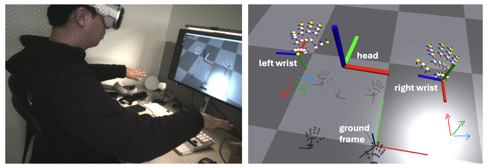

<!-- <div style="display:none"> -->
<div align="center">

  <h1 align="center"> Humanoid Arm Retarget </h1>
  <h3 align="center">
    Use VisionPro to teleoperate any humanoid robot arm.
  </h3>
</div>
<p align="center">
  <!--  -->

  <!-- code check badges -->
  <!-- <a href='https://github.com/Hao-Starrr/humanoid-arm-retarget/blob/main/.github/workflows/test.yml'>
      
  </a> -->
  <!-- issue badge -->
  <a href="https://github.com/Hao-Starrr/humanoid-arm-retarget/issues">
  
  </a>
  <a href="https://github.com/Hao-Starrr/humanoid-arm-retarget/issues?q=is%3Aissue+is%3Aclosed">
  
  </a>
  <!-- release badge -->
  <a href="https://github.com/Hao-Starrr/humanoid-arm-retarget/tags">
  
  </a>
  <!-- pypi badge -->
  <!-- <a href="https://github.com/Hao-Starrr/humanoid-arm-retarget/tags">
  
  </a> -->
  <!-- license badge apache -->
  <a href="https://github.com/Hao-Starrr/humanoid-arm-retarget/blob/main/LICENSE">
      
  </a>
</p>

<div align="center">
  <h4>This repo originates from <a href="https://humanoid-manipulation.github.io/">Humanoid Manipulation Project</a></h4>
</div>

## Introduction

This repository is designed to retarget human arm movements to 7 degrees of freedom humanoid robot arm motions.
It provides a VisionPro program to obtain hand detection data, calculates the angle of each joint based on the robot's setup.

```
VisionPro --hand tracking data--> Computer
Computer --joint angles--> Robot
```

You only need to provide your **robot's control API** in `interface.py` and **forward kinematics** in `arms_retarget.py` to achieve teleoperation of your robot.
It also provides a first-person view, giving the operator an immersive feeling when controlling the robot.

This repository combines the advantages of [VisionProTeleop](https://github.com/Improbable-AI/VisionProTeleop), [television](https://github.com/OpenTeleVision/TeleVision) to achieve **stable**, **fast**, and **accurate** robot teleoperation.

It provides configuration files for the following robots:

- fftai_gr1
- fftai_gr2
- open_loong

You can add your own robot's configuration files.

## Demo

### Snap to launch!


<!-- Except for the first video 1.1x speed for GIF compression, all the videos are at 1x speed. -->

### Arms


### Hands

<!--  -->

<div style="display: flex; gap: 5px;">
  
  
</div>

### Upper body

<!--  -->

https://github.com/user-attachments/assets/9c013594-2181-47f7-a190-bb754c1fd934

### Short Tasks


### Long Tasks with Visualizations

Cleaning the table (click image to see the video):

<a href="https://www.youtube.com/watch?v=McLAlGZYsGI">
  
</a>

<br>

Plugging the key into holes (click image to see the video):

<a href="https://www.youtube.com/watch?v=JSmodS4zys0">
  
</a>

## Performance

The code is tested on 14th gen i5 intel CPU, using 1 core.

The main loop runs at **90hz**.

The control latency is less than **30ms**, vision latency not tested.

The human-in-the-loop accuracy is less than **3mm** (partially depends on hardware).

## Difference with other repo

[Open-Television](https://github.com/OpenTeleVision/TeleVision)
Open-Television transmits hand poses through WebXR. This repo uses VisionPro app's API to obtain hand and forearm poses. Therefore, it can obtain more information for retargeting (especially the elbow), enabling full degrees of freedom control. This repo also uses relaxed IK to achieve stable control process, providing stable solutions when handling large-scale movements, without entering strange postures.

[unitreerobotics/avp_teleoperate](https://github.com/unitreerobotics/avp_teleoperate)
Unitree's avp teleoperate provides teleoperation for Unitree based on H1_2's URDF, using pinoccio to model robot kinematics and casadi to solve inverse kinematics. This repo provides an interface to other robots, requiring only FK and control interface to achieve teleoperation.

[Anyteleop](https://yzqin.github.io/anyteleop/)
Anyteleop mainly focuses on teleoperating co-robots. This library focuses on teleoperating 7-DOF humanoid arms, with degrees of freedom distributed as 3-2-2 or 3-1-3 like human.

[dex-retargeting](https://github.com/dexsuite/dex-retargeting)
Dex-retargeting is a general-purpose hand retargeting. This repo only adapts to 6-DOF retargeting similar to the Inspire hand. If you are using other hand types, we highly recommend you to use dex-retargeting. And it is welcome to contribute to other hand types.

## File Structure

```
-----
|   teleop.py
|         [main function, a loop in 90hz to send commmand to the robot]
|   arms_retarget.py
|         [input human arm frames, optimize and output the 14 joint angles ]
|   hands_retarget.py
|         [input human hand frames, calculate the 6 angles per hand]
|   gesture.py
|         [update the values in main loop, detect the snap]
|   camera_interface.py
|         [capture the images from different cameras]
|   sliverscreen.py
|         [upload the vision streaming to local server]
|   interface.py
|         [controllers, send the commands to robots]
|
|   fftai_gr1.yaml
|   open_loong.yaml
|         [configuration files]
|
+---avp_stream
+---Tracking Streamer
|   Tracking Streamer.xcodeproj
|         [VisionPro app]
```

## Install

##### 1 install tracking streamer app

It is a VisionPro app to get the hand tracking data.

Change the web server address in the app to your server address in [🌐RealityView.swift](./Tracking Streamer/🌐RealityView.swift). It is the address that publishes the image stream. You can also comment out this line if you do not need first person view.

How to install the app, refer to https://github.com/Improbable-AI/VisionProTeleop/blob/main/how_to_install.md

Then your computer can receive the hand tracking data as:

```python
from avp_stream import VisionProStreamer
avp_ip = "10.31.181.201"   # example IP
s = VisionProStreamer(ip = avp_ip, record = False)

while True:
    r = s.latest
    print(r['head'], r['right_wrist'], r['right_fingers'])
```

##### 2 install python package

```
pip install -r requirements.txt
```

##### 3 install television

For first person view.

You can skip this if you do not need.

Refer to https://github.com/OpenTeleVision/TeleVision, Local streaming part.

##### 4 fill the forward kinematics

In `arms_retarget.py`, fill the `left_fk` and `right_fk` function to calculate the joint angles from the end effector to the base.
Change the `config_file` to your robot's configuration file.

The `config_fftai_gr1.yaml` and `config_open_loong.yaml` are examples. The transform matrices are based on 5 joints forward kinematics.

##### 5 fill the interface

In `interface.py`, fill the `send_command` function to send the joint angles to your robot.

The fft_ai's humanoid robot and Inspire's hand examples are given in `interface.py`.

## Tests

1. Test the image server

```
cd ~/humanoid-arm-retarget
python sliverscreen.py
```

It is the image server. Run it and you should be able to see the stream from the camera in the browser. You can use the phone to test, making sure the phone and computer are in the same local network.

2. Open the tracking streamer app on your VisionPro.

You should be able to see the stream in the app. And the hand tracking data will be sent to the computer. Print the data in the terminal to check.

3. Run the teleoperation

```
python teleop.py
```

It is the teleoperation main loop. It should be able to give the joint angles to the robot.

4. Send the joint angles to the robot.

Snap your left fingers to send the data to the robot.

## Reference

Park, Y. Teleopeation System using Apple Vision Pro (Version 0.1.0) [Computer software]. https://github.com/Improbable-AI/VisionProTeleop

Rakita, D., Mutlu, B., & Gleicher, M. (2018). RelaxedIK: Real-time Synthesis of Accurate and Feasible Robot Arm Motion. In Proceedings of Robotics: Science and Systems. Pittsburgh, Pennsylvania.

Cheng, X., Li, J., Yang, S., Yang, G., & Wang, X. (2024). Open-TeleVision: Teleoperation with Immersive Active Visual Feedback. arXiv preprint arXiv:2407.01512.

## Data Structure

avp_stream sends the following data:

```python
r['head']: np.ndarray
  # shape (1,4,4) / measured from ground frame
r['right_wrist']: np.ndarray
  # shape (1,4,4) / measured from ground frame
r['left_wrist']: np.ndarray
  # shape (1,4,4) / measured from ground frame
r['right_fingers']: np.ndarray
  # shape (27,4,4) / measured from right wrist frame
r['left_fingers']: np.ndarray
  # shape (27,4,4) / measured from left wrist frame
r['right_pinch_distance']: float
  # distance between right index tip and thumb tip
r['left_pinch_distance']: float
  # distance between left index tip and thumb tip
r['right_wrist_roll']: float
  # rotation angle of your right wrist around your arm axis
r['left_wrist_roll']: float
 # rotation angle of your left wrist around your arm axis
```

The coordinate system convention is as follows:




The 27 frames correspond to the 27 rotation matrices in the data.

The origin of 0th and 25th frames is the same. The coordinate axes directions are different.
The 25th frame's coordinate axes follow the direction of the forearm. The 0th reference frame's coordinate axes follow the direction of the palm.
The coordinate axes of the 25th and 26th reference frames are identical. The position of 26th is at the elbow.

<!-- </div> -->

## Cite

If you find the retarget algorithm in this repository useful for your research, you can cite:

```
@software{wenhao2024humanoid_retarget,
    title={Humanoid Arm Retarget},
    author={Wenhao Wang},
    year={2024},
    url = {https://github.com/Hao-Starrr/humanoid-arm-retarget},
}
```

and our work on humanoid manipulation:

```
@article{ze2024humanoid_manipulation,
  title   = {Generalizable Humanoid Manipulation with Improved 3D Diffusion Policies},
  author  = {Yanjie Ze and Zixuan Chen and Wenhao Wang and Tianyi Chen and Xialin He and Ying Yuan and Xue Bin Peng and Jiajun Wu},
  year    = {2024},
  journal = {arXiv preprint arXiv:2410.10803}
}
```
